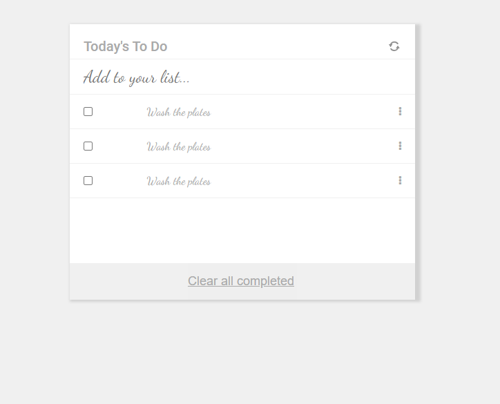

# TODO-LIST PROJECT

> This project is a Microverse exercise on Webpack that showcase the knowledge of HTML, CSS, Webpack Configuration, Jaavascript, import and export modules, string interpolation, arrays, objects, ES6 syntax.

## Built With

- Semantic HTML & CSS
- Webpack
- JavaScript
- Github workflow
- Linters(Lighthouse, stylelint, Webhint, eslint)

## Live Preview

[Github deploy Page](https://bimbolabuari.github.io/mv-todo-list/)

## Author

👤 **Abimbola Aminat Buari**

- GitHub: [bimbolabuari](https://github.com/bimbolabuari)
- Twitter: [bimbolabuari](https://twitter.com/bimbolabuari)
- LinkedIn: [bimbolabuari](https://linkedin.com/in/bimbolabuari)

## 🤝 Contributing

Contributions, issues, and feature requests are welcome!

Feel free to check the [issues page](../../issues/).

## Show your support

Give a ⭐️ if you like this project!

## Acknowledgments

- Microverse
- Code reviewer(s).

## 📝 License

[MIT licensed](./LICENSE).
